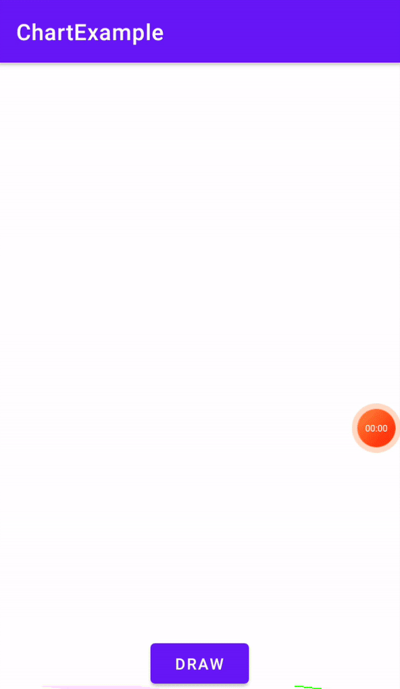

# Charts
[](https://jitpack.io/#asayushg/charts)
[](https://www.jitpack.io/#asayushg/charts)

### Gradle Setup

Step 1. Add the JitPack repository to your build file
Add it in your root build.gradle at the end of repositories:

	allprojects {
		repositories {
			...
			maven { url 'https://www.jitpack.io' }
		}
	}
Step 2. Add the dependency

	dependencies {
	        implementation 'com.github.asayushg:charts:1.0.1'
	}

<h2 id="examples">Examples :eyes:</h2>




<h2 id="documentation">Documentation :notebook_with_decorative_cover:</h2>
<h4> 1. Pie Chart </h4>

Add the PieChart View in your layout as:
``` 
<saini.ayush.chart.PieChart
    android:id="@+id/pieChart"
    android:layout_width="125dp"
    android:layout_height="125dp"
    .../>
```

Create a list of Slice with percentage and color and submit to PieChart view as:
``` 
val list = ArrayList<PieChart.Slice>()
list.add(
	PieChart.Slice(
    	   percentage = 20f,
           color = Color.RED
        )
    )

val pieChart = findViewById<PieChart>(R.id.pieChart)
pieChart.submitList(pieChartList = list, borderSize = 10f, borderColor = Color.GRAY)
// set borderSize and borderColor
pieChart.setBorder(10f, Color.BLACK)
```

### Charts Available
- [x] Pie Chart
- [ ] Doughnut Chart
- [ ] Bar Chart
- [ ] Line Chart
- [ ] Area Chart
- [ ] Scatter Plot
